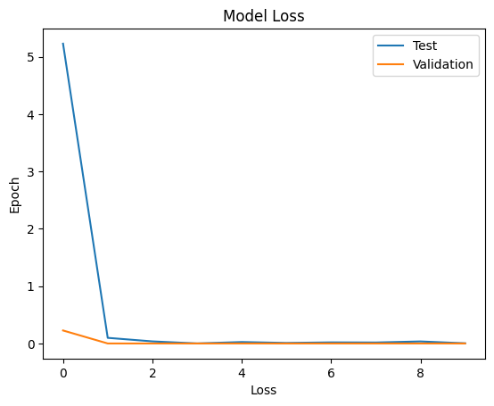

# Alzheimer’s Disease Stage Classification (4-Class CNN)

A Keras/TensorFlow **Convolutional Neural Network (CNN)** for classifying brain images into **4 dementia stages**:

- **Non Demented**
- **Mild Dementia**
- **Moderate Dementia**
- **Very Mild Dementia**

> **Disclaimer:** This project is for educational/research purposes only and is **not** a medical device. Do not use it for clinical decisions.

---

## Repository Contents

- `DementiaDetection.ipynb` — complete notebook: data loading, preprocessing, training, evaluation (confusion matrix), and single-image inference.
- *(optional)* `assets/` — figures for README (loss curve + confusion matrix).

---

## Dataset Structure

The notebook expects the dataset to be organized in **four folders** (one per class). Example:
Data/
├── Non Demented/
├── Mild Dementia/
├── Moderate Dementia/
└── Very mild Dementia/

⚠️ Folder naming must match your paths in the notebook. If your folder name differs (e.g., `Very Mild Dementia` vs `Very mild Dementia`), update the path accordingly.

---

## Preprocessing

Inside the notebook, the preprocessing pipeline is:

1. Collect image paths from each class folder.
2. Use **450 images per class** (balanced subset) → total **1800 images**.
3. Resize all images to **128×128**.
4. Keep only **RGB** images with shape `(128, 128, 3)`.
5. Labels are encoded using **One-Hot Encoding** for 4 classes.

> Note: Pixel normalization (e.g., dividing by 255) is **not** applied in the current notebook.

---

## Train / Validation / Test Split

The notebook splits the dataset as follows:

- **Test:** 20%
- **Validation:** 15% of the remaining data
- **Training:** the rest

Observed split sizes from the notebook run:

- **Train:** 1224 images  
- **Validation:** 216 images  
- **Test:** 360 images  

Randomization is enabled using `shuffle=True` and `random_state=42`.

---

## Model Architecture

The model is a compact CNN with two convolutional blocks followed by a dense classifier:

### Feature Extraction
- **Conv2D (32 filters, 2×2) + ReLU**
- **Conv2D (32 filters, 2×2) + ReLU**
- **BatchNormalization**
- **MaxPooling2D (2×2)**
- **Dropout (0.25)**

- **Conv2D (64 filters, 2×2) + ReLU**
- **Conv2D (64 filters, 2×2) + ReLU**
- **BatchNormalization**
- **MaxPooling2D (2×2, stride 2)**

### Classification Head
- **Flatten**
- **Dense (512) + ReLU**
- **Dropout (0.5)**
- **Dense (4) + Softmax**

### Model Size
- **Total parameters:** ~33.6M  
- Most parameters are introduced by `Flatten → Dense(512)`.

### Compilation
- **Loss:** `categorical_crossentropy`
- **Optimizer:** `Adamax`
- **Metric:** `accuracy`

---

## Training Setup

The notebook trains the model using:

- **Epochs:** 10  
- **Batch size:** 10  
- **Validation:** enabled

A loss curve is plotted after training.

---

## Results (Recorded Notebook Run)

### Final Epoch Accuracy
From the training logs at **Epoch 10/10**:

- **Training Accuracy:** **99.84%**
- **Validation Accuracy:** **100.00%**

### Test Accuracy (from Confusion Matrix)
Confusion matrix on the **360-image test set** shows **359 correct predictions**:

- **Test Accuracy:** **99.72%** (359 / 360)

### Per-Class Recall (Sensitivity)
Computed from the test confusion matrix:

- **Non Demented:** 100.00%
- **Mild Dementia:** 98.89%
- **Moderate Dementia:** 100.00%
- **Very Mild Dementia:** 100.00%

### Macro Averages (Test Set)
- **Macro Precision:** 99.73%
- **Macro Recall:** 99.72%
- **Macro F1-score:** 99.73%

---

## Figures

Place these files in `assets/` and the README will render them:

- `assets/loss_curve.png`
- `assets/confusion_matrix.png`

Example:

```md


